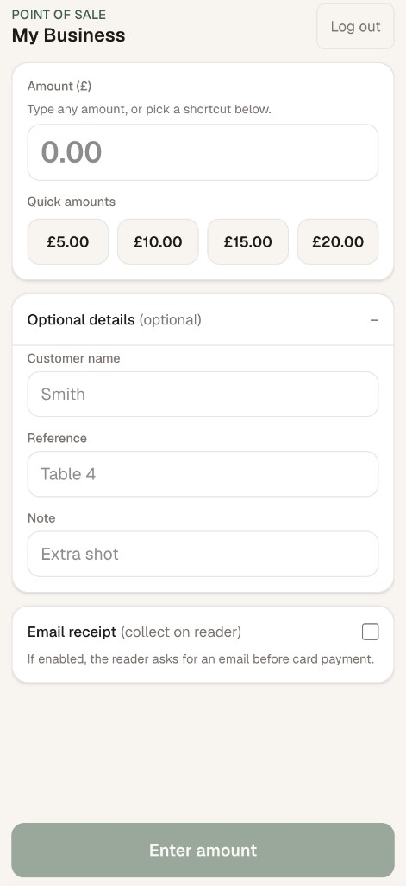

# Really Simple Stripe Terminal POS

**A free, open-source point-of-sale for in-person card payments.**

Run it on a phone or tablet. Connect a [Stripe Terminal](https://docs.stripe.com/terminal) reader (e.g. **BBPOS WisePOS E**). Take payments — no monthly POS subscription, no vendor lock-in beyond Stripe’s own fees.

MIT licensed. Fork it, deploy it, rename it. One file to customize: [`src/lib/branding.ts`](src/lib/branding.ts).



---

## Why use this?

Most small businesses don’t need a full retail POS. They need:

- Enter an amount (or tap a quick preset)
- Customer pays on a card reader
- Payment shows up in Stripe Dashboard

That’s what this app does. Nothing else — no inventory, no tables, no kitchen display. Just **charge → paid**.

Built with Stripe’s **server-driven** Terminal integration: your Stripe secret key stays on the server, and the reader only shows Stripe’s payment UI.

---

## Features

- **Simple charge screen** — amount, optional customer/reference/note, quick-amount buttons
- **WisePOS E** (or simulated reader for testing)
- **Cancel** from the app or on the reader
- **Email receipts** — optional; customer enters email on the reader before paying
- **Staff PIN** — lightweight login, no user accounts to manage
- **Test mode** — simulated reader + in-app card simulation
- **PWA-friendly** — add to home screen on iPhone/tablet
- **Restricted Stripe keys** — scope API access to what this app needs

---

## What you need

| Requirement | Notes |
|-------------|--------|
| [Stripe account](https://dashboard.stripe.com/register) | With Terminal enabled |
| Card reader | WisePOS E in production, or `simulated-wpe` for testing |
| Hosting | [Vercel](https://vercel.com) (recommended) or any Node.js host for Next.js |
| Staff device | Phone or tablet with a browser |

You pay Stripe’s normal processing fees. This software is **free**.

---

## Quick start

```bash
git clone https://github.com/knv568/stripe-terminal.git
cd stripe-terminal
cp .env.example .env.local
# Add your Stripe test key, reader ID, PIN, and session secret
npm install
npm run dev
```

Open [http://localhost:3000](http://localhost:3000), sign in with your PIN, and charge.

**Test reader:** Stripe Dashboard (test mode) → Terminal → Register reader → registration code `simulated-wpe`.

**Simulate a payment:** Tap **Charge**, then **Simulate card tap (test)** in the app.

Run tests: `npm test`

---

## Make it yours

Edit [`src/lib/branding.ts`](src/lib/branding.ts):

| Setting | What it changes |
|---------|-----------------|
| `BRAND.businessName` | Header and receipt description in Stripe |
| `BRAND.locationSubtitle` | Subtitle under the title (empty string to hide) |
| `BRAND.pageTitle` | Browser tab / PWA name |
| `STRIPE_TAGS` | Metadata on each payment (`payment_type`, `source`) |
| `QUICK_AMOUNTS_GBP` | Preset amount buttons (defaults: £5, £10, £15, £20) |

Deploy to Vercel, set the four env vars (see below), open the URL on staff devices, **Add to Home Screen** — done.

---

## How it works

| Step | Who | What happens |
|------|-----|----------------|
| 1 | Staff | Open the POS on a **phone or tablet** |
| 2 | Staff | Enter amount (+ optional customer / reference / note). Optionally enable **Email receipt** |
| 3 | Staff | Tap **Charge** |
| 4 | Customer | *(Email receipt only)* Enter email on the **reader**, or tap **Skip** |
| 5 | Customer | Tap or insert card on the **reader** |
| 6 | Staff | See **Paid**; payment appears in Stripe Dashboard *(+ receipt email if step 4 provided an address)* |

Skip step 4 if **Email receipt** is off. The reader cannot run this web app — it only shows Stripe’s payment UI ([WisePOS E setup](https://docs.stripe.com/terminal/payments/setup-reader/bbpos-wisepos-e)).

**Wrong amount?** Tap **Cancel transaction** in the app or **Cancel** on the reader, fix the amount, and charge again.

---

## Email receipts — test mode

On a **live reader**, the customer uses the reader screen for step 4 above.

In **test mode**, the simulated reader has no email keyboard. After **Charge** (step 3), run this in a separate terminal (use your `STRIPE_READER_ID`):

```bash
# Simulate customer entering an email (Stripe uses someone@example.com)
stripe terminal readers test_helpers succeed_input_collection tmr_xxx \
  --skip-non-required-inputs=none

# Simulate customer tapping Skip
stripe terminal readers test_helpers succeed_input_collection tmr_xxx \
  --skip-non-required-inputs=all
```

Then **Simulate card tap (test)** in the app.

Docs: [Collect inputs](https://docs.stripe.com/terminal/features/collect-inputs) · [Test helper API](https://docs.stripe.com/api/terminal/readers/succeed_input_collection)

---

## Environment variables

Copy [`.env.example`](.env.example) to `.env.local` locally. On Vercel: **Project → Settings → Environment Variables**.

| Variable | Description |
|----------|-------------|
| `STRIPE_SECRET_KEY` | Restricted key `rk_test_...` (dev) or `rk_live_...` (production) |
| `STRIPE_READER_ID` | Reader ID from Terminal → Readers — **must match key mode** |
| `POS_ACCESS_PIN` | Staff PIN (4–8 digits) |
| `POS_SESSION_SECRET` | Random secret for sessions — `openssl rand -hex 32` |

Never commit `.env.local`.

---

## Restricted API key (recommended)

Use a **restricted key** (`rk_...`) scoped to this app only.

1. [Dashboard → API keys](https://dashboard.stripe.com/apikeys) → **Create restricted key**
2. Permissions (everything else **None**):

| Resource | Permission |
|----------|------------|
| Payment Intents | **Write** |
| Terminal → Readers | **Write** |

Create separate keys for **Test** and **Live**. Docs: [Restricted API keys](https://docs.stripe.com/keys/restricted-api-keys)

---

## Deploy to Vercel

1. Push this repo to GitHub  
2. [vercel.com/new](https://vercel.com/new) → import → **Next.js**  
3. Add all four environment variables (live values for production)  
4. Deploy  
5. Optional: add a custom domain (e.g. `pos.yourbusiness.com`)  
6. Staff: open the URL → sign in → **Share → Add to Home Screen**

---

## Payments in Stripe Dashboard

Each charge includes metadata you can filter on:

| Field | Default / notes |
|-------|-----------------|
| `payment_type` | `pos` (from `STRIPE_TAGS`) |
| `source` | `really-simple-stripe-terminal-pos` |
| `customer_name`, `reference`, `note` | Optional customer details |

Useful if you run other Stripe integrations on the same account.

---

## For developers

| Route | Method | Auth | Purpose |
|-------|--------|------|---------|
| `/api/auth/login` | POST | — | Staff PIN → session |
| `/api/auth/logout` | POST | — | Clear session |
| `/api/charge` | POST | Yes | Email collect (optional) + PaymentIntent + reader |
| `/api/cancel-payment` | POST | Yes | Cancel reader + PaymentIntent |
| `/api/payment-intent/[id]` | GET | Yes | Poll status |
| `/api/simulate-card` | POST | Yes | Test-mode card tap |
| `/api/config` | GET | — | `{ testMode }` |
| `/api/reader` | GET | Yes | Reader status |

**Stack:** Next.js 15, React 19, TypeScript, Tailwind CSS v4, Stripe Node SDK, Vitest.

Architecture and conventions: [AGENTS.md](./AGENTS.md).

---

## Security

- Stripe secrets server-side only  
- PIN + signed `httpOnly` session (12h)  
- Poll/cancel limited to PaymentIntents created by this app  
- £1,500 max per charge (server + UI)  
- Security headers via `next.config.ts`  
- Use a strong PIN; restrict who has the URL  

---

## Troubleshooting

| Issue | What to check |
|-------|----------------|
| `No such reader ... livemode false` | Test key with live reader (or opposite) |
| Reader offline | Power, Wi‑Fi, online in Dashboard |
| Reader busy | Payment or cancel in progress |
| Unauthorized | Sign in again (session expired) |
| Email entry timed out | Retry **Charge** |
| No receipt email | Customer skipped on reader; check `receipt_email` on PaymentIntent |

---

## License

**MIT** — free to use, modify, and distribute. See [LICENSE](./LICENSE).

---

## Links

- [Stripe Terminal](https://docs.stripe.com/terminal)  
- [Server-driven integration](https://docs.stripe.com/terminal/payments/setup-integration?terminal-sdk-platform=server-driven)  
- [WisePOS E setup](https://docs.stripe.com/terminal/payments/setup-reader/bbpos-wisepos-e)  
- [AGENTS.md](./AGENTS.md) — architecture & contributor notes
